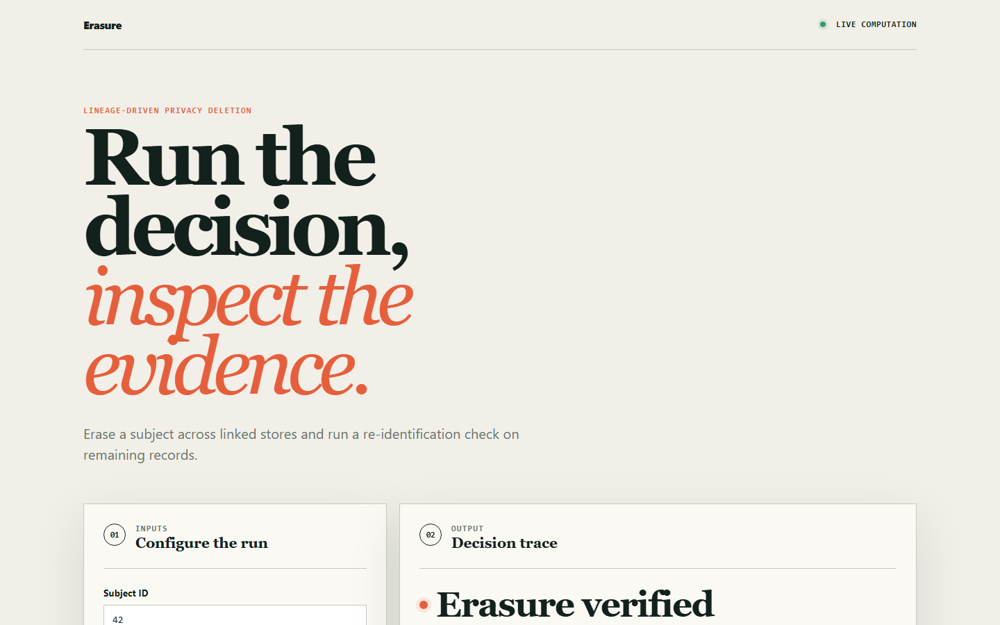
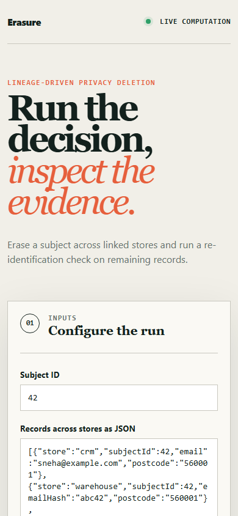

# erasure

> GDPR erasure driven by column-level lineage, verified by an adversary that tries to re-identify the person you just deleted.

## Live deployment

[](https://github.com/SlateGitOrg/erasure/actions/workflows/ci.yml)

[Open the working Erasure application](https://slategitorg.github.io/erasure/)

This deployed application runs the project's decision workflow in the browser. Change the inputs, run the analysis, and inspect the computed metrics and decision trace.

### Desktop



### Mobile



`FLAGSHIP` · **Cybersecurity** · Advanced · ~4-5 weeks · Retail - EU e-commerce

**Primary language:** TypeScript
**Tags:** `privacy`, `gdpr`, `lineage`, `pii`, `sql`, `data-governance`

---

## The problem

A customer exercises their right to erasure. The team deletes them from the users table. Their personal data remains in the analytics warehouse, three CSV exports, the search index, the email provider's suppression list, and last month's database backup. The company is now non-compliant *and* believes it is compliant, which is the worse of the two states because nobody is looking.

## ⭐ The differentiator

Discovery is **lineage-driven and continuously verified**: a PII classifier maps every column across every store, lineage tracks propagation into derived tables and exports, and a **re-identification adversary actively attempts to reconstruct the erased subject from what remains** - quasi-identifier joins included. A generic DSAR project maintains a hand-written list of tables, which is stale the day after it is written and has no way to know.

This is the sentence to lead with when someone asks you to walk through the
project. Everything else in this repo exists to make it true and to prove it.

## Data

A synthetic multi-store estate (PostgreSQL OLTP, DuckDB warehouse, OpenSearch index, MinIO exports) generated with realistic PII propagation, including **planted hidden copies** in non-obvious places. Discovery recall against those planted copies is the headline metric.

> No paid API key is required to run or demo this project. Where a paid
> service would add value it is wired as an optional enhancement behind an
> interface with an offline mock as the default implementation.

## Stack

- TypeScript
- PostgreSQL, DuckDB, OpenSearch, MinIO (the estate)
- OpenLineage for column-level lineage
- Docker Compose, Vitest

## Core capabilities

- Automated PII classification with confidence scoring and a human-review queue for low-confidence columns
- Column-level lineage graph spanning OLTP, warehouse, search index and file exports
- Erasure orchestration with per-store adapters, dry-run mode, and a signed completion certificate
- Re-identification adversary attempting quasi-identifier reconstruction after erasure
- Legal-hold and retention-obligation exceptions recorded with the specific legal basis, not a boolean

## Repository layout

```
src/classify/
src/lineage/
src/erase/                # one adapter per store
src/adversary/
generator/
test/recall/
```

## Build plan

1. Build the estate and the propagation generator, planting hidden copies you record.
2. Classifier and lineage next - lineage is what makes discovery survive schema change.
3. Erasure adapters with dry-run before destructive mode. Always.
4. Adversary last, and make sure it succeeds pre-erasure - otherwise it proves nothing post-erasure.

## Testing strategy

Assert **100% discovery recall** against planted hidden copies. Assert the adversary's re-identification success rate is zero after erasure **and non-zero before it** - without that second assertion the adversary has no demonstrated power and the zero means nothing.

Tests assert **correctness**, not merely that the code runs. A green suite on
this repo is a claim about behaviour under adversarial conditions; treat any
test that would pass against a deliberately broken implementation as a bug in
the test.

## Quality & safety layer

Documented threat model covering insider access and backup-restore re-introduction. Dry-run is the default; destructive execution requires an explicit flag and writes a signed certificate.

## Measurable outcome

> Erasure requests complete across six data stores in under four minutes with a verifiable certificate, and an adversarial re-identification attempt that succeeds before erasure fails afterwards.

State it in these terms — business units, not technical ones — in your CV
bullet and in the first thirty seconds of describing the project.

## Interview questions this project answers

- **How do you know you deleted everything?**
- **What is a quasi-identifier, and why does deleting the name not help?**
- **How do you handle backups under a right-to-erasure request?**

## What this deliberately is *not*

- Not legal advice, and not a compliance certification. It is the engineering control beneath the policy.
- Not a data catalogue - it borrows lineage, it does not reimplement one.


## Run it now

```bash
npm test        # runs the suite; no install step needed
npm run demo    # the 60-second artefact
```

Requires Node 22.6+ (24 recommended). TypeScript runs natively via
type stripping - there is no build step and no `node_modules`.

## Getting started

```bash
git clone <your-fork-url> erasure
cd erasure
docker compose up -d          # 4-store estate
npm install
npm run generate              # PII with planted propagation
npm run classify && npm run lineage
npm run erase -- --subject 4412 --dry-run
npm run test:recall
```

Docker is supported but optional — every path above works on a plain
Windows/macOS/Linux laptop without a cloud account.

## Definition of done

- [ ] The differentiator above is implemented, and a test proves it
- [ ] The measurable outcome is produced by a command anyone can run
- [ ] `README` explains the one decision a generic version gets wrong
- [ ] CI runs the full suite on every push and is green on `main`
- [ ] A recruiter can see the headline artefact in under 60 seconds

## Licence

MIT — see [LICENSE](LICENSE).
